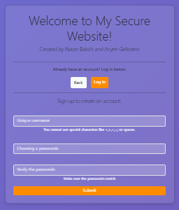
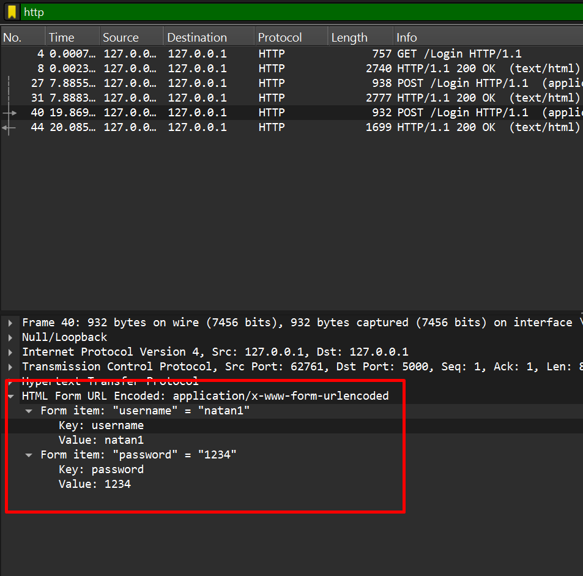
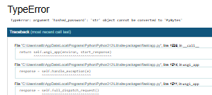

# secure-website
הקמנו אתר מאובטח הכולל צד לקוח, צד שרת ובסיס נתונים.

#          צד הלקוח 
כולל ארבעה קבצי HTML
1. welcome.html- קובץ פתיחה לכניסה ראשונית לאתר, המציג את אפשרויות הכניסה (login, sign up)
2. log_in.html- דף המשרת משתמשים הרשומים לאתר, ונותן להם את האופציה להכנס על ידי שימוש בשם משתמש וסיסמא
3. sign_up.html- משמש משתמש חדש להקים משתמש במערכת לכניסה עתידית
4. hom.html- דף הבית אחר הכניסה למערכת  

# צד השרת 
כולל שני קבצי פייתון
1. app.py- מפעיל את השרת, שולח ומקבל נתנוים מהלקוח, שומר את הנתונים בבסיס נתונים ומשתמש בהם לפי הצורך.
2. helper.py- קובץ המכיל פונקציות שמשרתות את השרת, כמו בדיקת סיסמאות, משתמשים ואבטחה.

#  בסיס הנתונים 
כולל שלושה קבצים עיקריים
1. db-create.py- יוצר קובץ בסיס נתנוים חדש
2. db-insert.py- קובץ המשמש להטענת נתונים חדשים לבסיס הנתונים
3. users.db- קובץ הכולל את הנתונים עצמם

# פונקציונליות
האתר יודע להתגונן מפני מתקפות sqli ומגבב את הסיסמאות לפני האיחסון שלהם.

# קצת על התהליך
במהלך התהליך למדנו להכיר עולמות חדשים של קוד שלא נפגשנו איתו בעבר, כתיבת קבצי HTML, ניהול שרת ולקוח והבנה עמוקה של תהליכים שבעבר נראו כמובנים מאליהם.
הדרך לא היתה פשוטה, נתקלנו בהמון באגים לא מוסברים ונאלצנו ללמוד המון לבד, וכשכבר עמד אתר על תילו, הרסנו אותו לגמרי כשניסינו להוסיף אבטחה מינימלית. נפלנו וקמנו ושוב קמנו עד שהמוצר הזה הגיע אליכם. תתייחסו אליו יפה, זה מגיע לו.  

אחת הדרישות המרכזיות של הפרויקט היתה לאבטח את האתר, ולצערי לא הצלחנו לאבטח את התקשורת שבין הלקוח לשרת ופרוטוקול ההעברה הינו HTTP שאינו מאובטח מהסנפות כפי שניתן לראות בתמונה.

האתגרים העיקריים היו בהתקנת תעודות ותקשורת עם SSL, משהו שעוד נצטרך להמשיך ולנסות לפתור בעתיד. 
 
מבחינת שאר יעדי הפרויקט כמו יצירת פונקציונליות עם אגרי אבטחה, לא הספקנו להשיג ונעשה זאת גם כן בעתיד.  
   
  

במהלך העבודה נתקלנו בקשיים שעצרו את הסוסים מלדהור, כך למשל אופן החזרת השגיאות ללקוח לאחר הבדיקה בשרת, שהחלטנו לבסוף לשנות את הדף כך שיכיל הודעה משתנה על ידי משתנים (ולא לפתוח דף נפרד לכל סוג שגיאה, או להחזיר את השגיאה כטקסט פשוט). בנוסף, זמן רב העברנו בלנסות להתגונן מפני תקיפות על שאילתות SQL (SQLI) ובאופן הביצוע, בתחילה הפקודה לא עבדה והיה ניתן לעשות שאילות עם 1=1 ולהכנס עם כל סיסמה שהיא, לבסוף שינינו את הסינטקס והוצאנו את הבדיקה לפונקציה נפרדת ורק אז זה עבד. הסיבה לבעיה היתה שהפקודה היתה מוטמעת בתוך פונקציה שמחזירה ערך בוליאני והפקודה הזו גרמה שתמיד הערך יהיה TRUE, רק לאחר הפרדת הפונקציות הבעיה נפתרה.  
בעיה אחרת שעוד לא הספקנו לשבת עליה בצורה יעילה מחוסר זמן, היא כאשר הלקוח מכניס שם משתמש עם סיסמה שנקבעה ללא פונקציית האש וכעת הוא מכניס את הסיסמה לאחר הפעלת ההאש, המערכת לא מתריאה שהסיסמאות שונות, אלא ממש קורסת ולא מוצאת את הדף. יש להניח שיש הסבר פשוט לתופעה, אבל עוד לא ישבנו לחקור את זה.  
  
  
# לסיכום
היתה דרך נפלאה שעוד לא נגמרה, יש עוד על מה לעבוד אבל המטרה הושגה. טעמנו קצת יותר מהעולם שבין הלקוח לשרת וחשפנו את הפנים שמאחורי המסכה האינטרנטית. למרות שהאתר המאובטח שלנו לא ממש מאובטח. זה גם פרק שהיינו צריכים ללמוד. 

